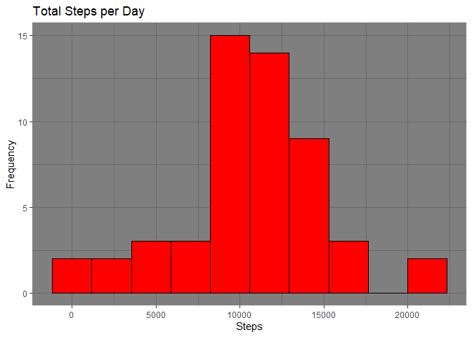
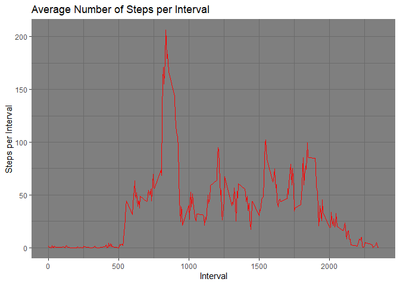
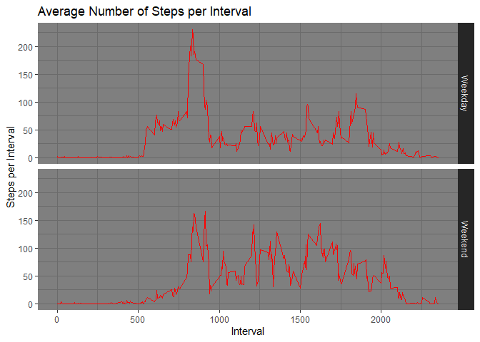

## Loading and preprocessing the data

```r
library(ggplot2)
library(lubridate)
library(chron)

activityData = read.csv("./activity/activity.csv")
activityData$date = ymd(activityData$date)
activityData$weekend = chron::is.weekend(activityData$date)
head(activityData)
```

```
##   steps       date interval weekend
## 1    NA 2012-10-01        0   FALSE
## 2    NA 2012-10-01        5   FALSE
## 3    NA 2012-10-01       10   FALSE
## 4    NA 2012-10-01       15   FALSE
## 5    NA 2012-10-01       20   FALSE
## 6    NA 2012-10-01       25   FALSE
```

## What is mean total number of steps taken per day?
### 1. Below is a histogram of the total number of steps taken each day

```r
library(ggsci)
library(dplyr)

activityTotalStepsDay = aggregate(steps ~ date, activityData, sum)

ggplot(activityTotalStepsDay, aes(x=steps)) + 
  geom_histogram(bins = 10,color="black", fill="red")+
        ggtitle(label = "Total Steps per Day")+
                ylab('Frequency')+
                xlab('Steps')+
                theme_dark()  
```

<!-- -->

```r
 cat("\n")
```
### 2.  Calculate and report the **mean** and **median** total number of steps taken per day

```r
mean(activityTotalStepsDay$steps)
```

```
## [1] 10766.19
```

```r
median(activityTotalStepsDay$steps)
```

```
## [1] 10765
```
## What is the average daily activity pattern?
### 1.Below is a time series plot of the 5-minute interval (x-axis) and the average number of steps taken, averaged across all days (y-axis)

```r
AverageDailyActivity = aggregate(steps ~ interval, activityData, mean)

ggplot(AverageDailyActivity, aes(x=interval, y=steps)) +
  geom_line( color="red") + 
  xlab("") +
        ggtitle(label = "Average Number of Steps per Interval")+
                ylab('Steps per Interval')+
                xlab('Interval')+
                theme_dark()  
```

<!-- -->

```r
 cat("\n")
```
### 2. The 5-minute interval, on average across all the days in the dataset, that contains the maximum number of steps

```r
AverageDailyActivity[which.max(AverageDailyActivity$steps), ]$interval
```

```
## [1] 835
```

## Imputing missing values
There are a number of days/intervals where there are missing values (coded as `NA`). The presence of missing days may introduce bias into some calculations or summaries of the data.

### 1. The total number of missing values in the dataset (i.e. the total number of rows with `NA`s) is:

```r
sum(is.na(activityData$steps))
```

```
## [1] 2304
```
### 2. The missing step data was replaced with the mean for the 5 minute interval that it belonged to and a new dataset was created that is of the same length as the original dataset. 

```r
activityDataImpute = activityData %>% 
        group_by(interval) %>%
        mutate(steps=ifelse(is.na(steps),mean(steps,na.rm=TRUE),steps)
               )
```
The replacement of the missing values with the mean number of steps for each associated interval did not change the overall mean or median step value significantly.

## Are there differences in activity patterns between weekdays and weekends?

### 1. First a new factor variable in the dataset with two levels -- "weekday" and "weekend" indicating whether a given date is a weekday or weekend day was created.

```r
activityDataImpute = mutate(activityDataImpute, type = ifelse(weekend == "TRUE", "Weekend", "Weekday"))
head(activityDataImpute)
```

```
## # A tibble: 6 x 5
## # Groups:   interval [6]
##    steps date       interval weekend type   
##    <dbl> <date>        <int> <lgl>   <chr>  
## 1 1.72   2012-10-01        0 FALSE   Weekday
## 2 0.340  2012-10-01        5 FALSE   Weekday
## 3 0.132  2012-10-01       10 FALSE   Weekday
## 4 0.151  2012-10-01       15 FALSE   Weekday
## 5 0.0755 2012-10-01       20 FALSE   Weekday
## 6 2.09   2012-10-01       25 FALSE   Weekday
```

### 2. The following is a panel plot created using ggplot2 and facteting which contains time series plots of the 5-minute interval (x-axis) and the average number of steps taken, averaged across all weekday days or weekend days (y-axis). 

```r
AverageDailyActivityImpute = aggregate(steps ~ interval+type, activityDataImpute, mean)

ggplot(AverageDailyActivityImpute, aes(x=interval, y=steps)) +
  geom_line( color="red") + 
  xlab("") +
        ggtitle(label = "Average Number of Steps per Interval")+
                ylab('Steps per Interval')+
                xlab('Interval')+
                theme_dark()+
        facet_grid(type ~.)
```

<!-- -->

```r
 cat("\n")
```
There are differnces in activity patterns between weekdays and weekends. There is an eariler onset of activity on the weekdays while the activity levels are higher during the mid-day on the weekends. 
